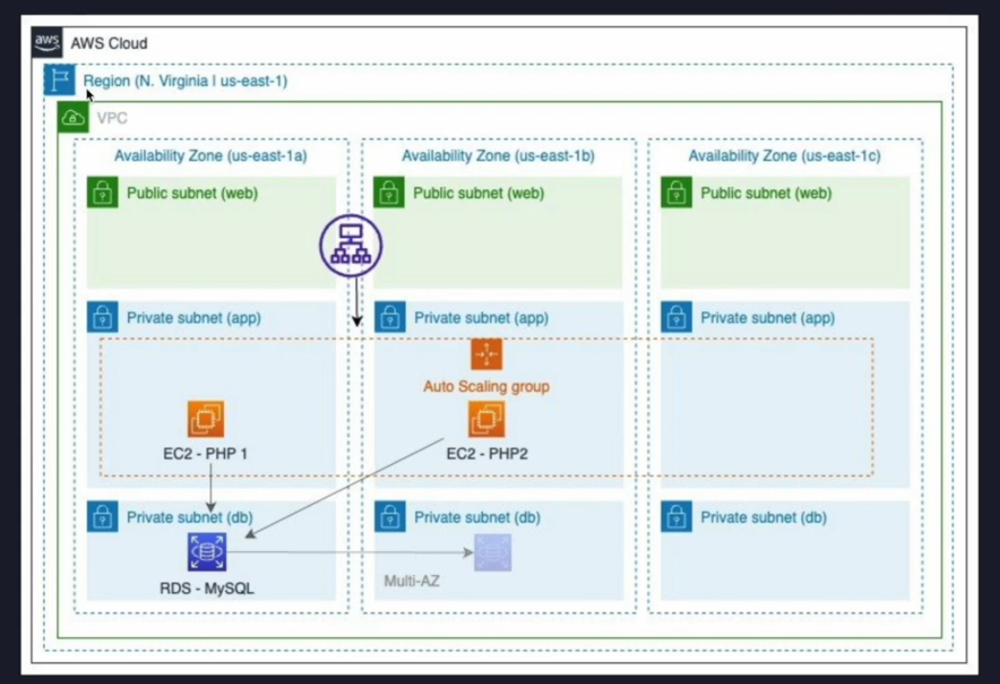

# THREE TIER ARCHITECTURE IN AWS USING TERRAFORM

## Demonstartion of a 3-Tier Cloud Architectural Design on AWS using Terraform

## Architectural Diagram


## What we want create

## Basic Pre-requisites


## Walkthrough (AWS Console)
* Login to AWS Console
* Select your prefered region
* Provision s3 bucket for tfstate (Terraform state) storage (my-s3-bucket-terraform-backend)
* DynamoDB table to store logging information (my-s3-bucket-terraform-backend)

## Basic Terraform workspace commands
```
terraform workspace list // To list all workspaces
terraform workspace new <new-workspace> // To create new workspace
terraform workspace show // To show current workspace
terraform workspace select prod // To switch workspace to "prod"

```
## To run based on Namespaces
```
terraform apply -var-file dev.tfvars  // To run terraform bases on variables from "dev.tfvars"
```